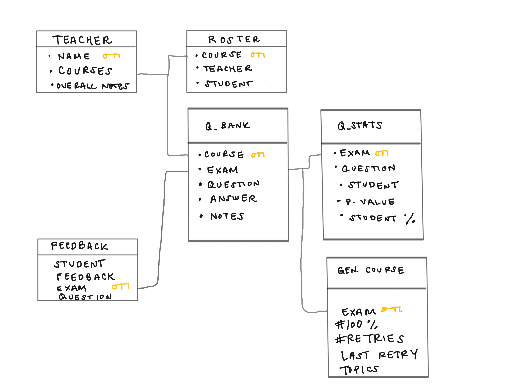

# s'CoolEd

## Inspiration
App that stands for "It's Cool Education." Learning should be organic and mistakes are normal. Therefore, s'CoolEd makes creating customizable teaching and iterative learning easy.

## [s'CoolEd Walkthrough](https://youtu.be/Ocooe5AjqjU)

## Question Generator

## User Stories

The following functionality is completed:
* [ ] Teacher perspective
  * [x] Absolutely no dummy data is generated by s'CoolEd, all information is retrieved from a database, specifically CockroachDB (CDB)
  * [x] Uses NLP to automatically generate quizzes from lesson plans and writes to CockroachDB (CDB)
  * [x] Reads contents of quizzes and feedback from students from CDB
  * [x] Creates supplementary notes that clarifies the question and answer (ideally this is sent to the students who missed the question)
  * [x] Allow teachers to upload lesson plans as direct text

**Future** features:
* [ ] Teacher perspective
  * [ ] Allow teachers to upload lesson plans as files or images
  * [ ] Receive p-value scores of individual questions in order to detect fallacies in the question itself
  * [ ] Receive notification if students' progress dips

* [ ] Student Perspective
  * [ ] Read quizzes, retry, and be able to submit feedback to instructor
  * [ ] Write grades and record retries to CDB
* [ ] Add an open community forum for student and teacher perspective (i.e. students have their own forum and teachers have their own)
  * [ ] People in the forum can discuss quizzes and lesson content
* [ ] Parent Perspective
  * [ ]  Parents get notification of their child(ren)'s grades, retry attempts, and forum comments (remove anonymity and enforce parents to be involved before it's too late) 

## Entity Relationship Diagram

